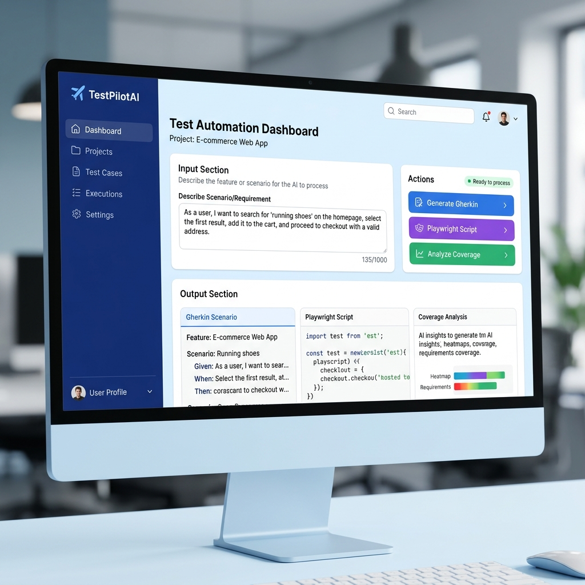

# 🚀 TestPilotAI
### *Next-Gen AI-Powered Test Automation Dashboard*

**TestPilotAI** is a high-fidelity, multi-agent AI system designed to revolutionize the software testing lifecycle. By orchestrating specialized **Agentic AI** nodes, it transforms plain-text requirements into structured BDD scenarios, production-ready Playwright scripts, and comprehensive coverage gap analyses—all within a premium, modern dashboard.

Built for the modern QA engineer, **TestPilotAI** simplifies the bridge between requirement gathering and automation execution with state-of-the-art aesthetics and collaborative AI intelligence.



---

## 📖 Project Overview
The traditional path from requirement to automated test is often fragmented and time-consuming. **TestPilotAI** orchestrates a pipeline of specialized agents—Requirement Analyzer, BDD Generator, Automation Engineer, and Quality Auditor—to automate this workflow.

**Key Capabilities:**
- **🧠 Intelligent Interpretation**: Parses high-level feature text to extract core testing logic.
- **📄 BDD Orchestration**: Drafts comprehensive Gherkin scenarios covering happy paths, negative flows, and edge cases.
- **🐍 Automation Engineering**: Generates robust, Page Object Model (POM) compliant Playwright Python scripts.
- **🔍 Quality Audit**: Identifies coverage gaps and missing validation checks using advanced visual metrics.

---

## 🏎️ Premium Dashboard Features

The application features a state-of-the-art UI/UX designed to feel alive and responsive:

*   **⚡ Modern Workspace**: A clean, card-based interface built with the Inter font and a sleek #F8FAFC professional palette.
*   **📂 Multi-Module Sidebar**: Integrated navigation with context-aware selection for specific application flows (e.g., Login, User Management).
*   **📊 Visual Metrics**: Real-time Heatmap and Requirements Coverage bars to visualize the depth of the generated test suite.
*   **🏗️ Grid-Based Output**: A three-column layout designed for side-by-side comparison of Gherkin, Python scripts, and Audit results.
*   **🔔 Interactive UI**: Top-bar navigation with search, notifications, and profile components for a full-application feel.
*   **🎯 Targeted Context**: Pre-optimized for the **OrangeHRM** ecosystem, providing high-precision selectors and flow logic.

---

## 🏗️ Multi-Agent Architecture

The system operates as a sophisticated pipeline where specialized agents collaborate:

1.  **Requirement Analyzer**: Interprets raw requirement text and extracts core testing logic.
2.  **BDD Generator Agent**: (`src/gherkin_generator.py`) Architected to draft comprehensive Gherkin scenarios.
3.  **Automation Agent**: (`src/playwright_generator.py`) A specialized coding agent that transforms BDD steps into robust Playwright Python scripts.
4.  **Coverage Analyzer Agent**: (`src/coverage_analyzer.py`) Performs a "Quality Audit" to identify missing validation checks.
5.  **LLM Orchestrator**: (`src/ai_engine.py`) Manages stateful communication with the OpenRouter/Groq API.

---

## 🛠️ Setup Steps

### 1️⃣ Clone the Repository
```bash
git clone <repository_url>
cd mini-project
```

### 2️⃣ Install Dependencies
Ensure you have Python 3.9+ installed:
```bash
pip install -r requirements.txt
playwright install
```

### 3️⃣ Configure Environment Variables
Create a `.env` file in the root directory:
```env
OPENROUTER_API_KEY=your_key_here
OPENROUTER_MODEL=openai/gpt-4o-mini  # or your preferred model
HTTP_REFERER=http://localhost:8501
X_TITLE=TestPilotAI
```

---

## 🚀 How to Run

Launch the premium Streamlit dashboard from the project root:

```bash
streamlit run src/app.py
```

Access the interface at `http://localhost:8501`.

---

## 📂 Project Structure
```text
mini-project/
├── src/                    # Source Code
│   ├── app.py              # Premium Dashboard & Orchestration
│   ├── ai_engine.py        # backend logic & LLM connection
│   ├── gherkin_generator.py # BDD agent logic
│   ├── playwright_generator.py # Automation agent logic
│   └── coverage_analyzer.py # Audit agent logic
├── docs/
│   └── screenshots/        # UI Visuals & Mockups
├── .env                    # Environment Secrets
├── requirements.txt        # Python Dependencies
└── README.md               # Project Documentation
```

---

### ⭐ Final Note
This project demonstrates the power of **Agentic AI**—where autonomous agents collaborate to solve complex, high-value engineering challenges with speed, precision, and a premium user experience."# thinkpalm-agentai-TestPilot-AI-AutoQA-Engine" 
"# thinkpalm-agentai-TestPilot-AI-AutoQA-Engine" 
